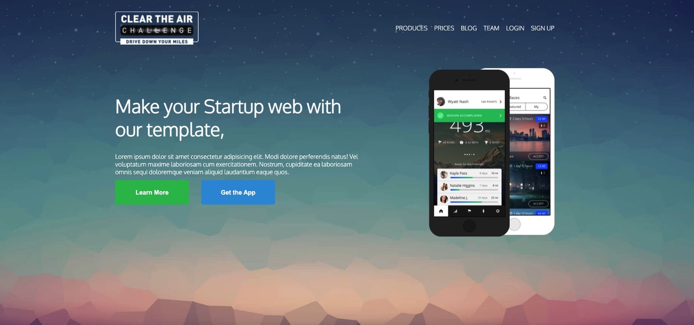

## Mobile Application Webpage

[Test this app yourself](https://maykaltenev.github.io/mobile-app/)

---

### About Project

This is a webpage for a mobile application. The project is made with CSS Flexbox Layout method.

### How to use this Project

The website is meant to practice on the CSS Flexbox declarations, such as:

- display: flex;
- justify-content;
- align-items;
- flex-grow;
- align-self;
- flex-wrap;
  The website is as well made with the position CSS property.

##### Developed With

- [x] _HTML5_
- [x] _CSS3_
- [ ] _SASS_
- [ ] _SCSS_
- [ ] _React_
- [ ] _Bootstrap_
- [x] _npm_

---

### Contact

Mail: <michaeltenev@mail.com> 
GitHub: [michaeltenev](https://github.com/maykaltenev) 
LinkedIn: [Maykal Tenev](https://www.linkedin.com/in/maykal-tenev-a8729586/)

---

### Used Tools

- [Google Fonts](https://fonts.google.com/)
- [Visual Studio Code](https://code.visualstudio.com/)

### Recourses

- [MDN Web Docs](https://developer.mozilla.org/de/)

---

Made with ❤️ by me
